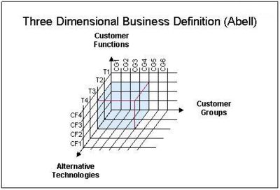

## 三维商业

  哈弗教授Derek F. Abell 三维商业定义(Three Dimensinal Business Definition) 是一项以定义商业的模型。

## 三维商业定义模型

- 所专注服务的顾客群。所专注服务的顾客群、所欲满足的顾客需要、满足这些需要所需的技术 顾客类别。（Who：为谁服务）
- 所欲满足的顾客需要。 顾客需求。 （What：需要什么）
- 满足这些需求所需的技术。 需求满足法。 （How：需求如何满足）

## 定义图

 1. Served Customer Groups. Categories of customers. (WHO)
 2. Served Customer Functions. Customer needs. (WHAT)
 3. Technologies Utilized. The way that the needs are being satisfied. (HOW)
   
 The business scope of the example company in the figure on the right is defined as: providing CF1, CF2 and CF3 to / for: CG1, CG2, CG3 and CG4 using: T1 and T2.

运用三维商业定义模型，右图案例公司的商业范围（Business Scope）则是： 运用T1、T2两项技术， 为CG1、CG2、CG3、CG4四个顾客群， 提供CF1、CF2、CF3三项服务。