## 战略

安索夫定义企业战略：

> 弄清你的位置，界定你的目标，明确为实现你的目前必须所采取的行动。 

## 安索夫矩阵(Ansoff Matrix)

> 策略管理之父安索夫博士于1957年提出安索夫矩阵，以产品和市场作为两大基本方面，区别出四种产品/市场组合和相对应的营销策略。是应用最为广泛的营销分析工具之一。

## 产品市场矩阵

- 市场渗透(Market Penetrarion)
  
  以现有的产品面对现有的顾客，以其目前的产品组合为为焦点，力求增大产品的市场占有率。采取市场渗透的策略，促销、降价、提升产品品质和提高服务质量等方式来说服消费者改用不同品牌的产品，或者说服消费者改变使用习惯、增加购买量。

  `本地化巩固老客户，拓展新同质用户`

  `从竞争对手中抢客户`

- 市场开发(Market Development)
  
  提供现有产品开拓新市场，企业必须在不同市场上找到相同需求的消费者，其中往往产品定位和销售方法有所调整，但产品本身的核心技术不必改变。

  `新的地域去卖老产品,寻找新的有需求的消费者`

- 产品开发(Product Development)

  推出新产品给老客户，采用产品延伸策略，利用现有的顾客关系来借力使力。通常以扩大现有产品的深度和广度，推出新一代或者相关产品给现有的顾客，提高该厂商在消费者中的占有率。
  
  `本地化开发新的相关产品，‘一带一路’卖给老用户`

- 多样化经营(Diversfication)
  
  提供新产品给新市场，此处由于企业的既有专业和知识能力可能派不上用场，因此是最冒险的多样化策略。其中成功的企业多半能在销售、通路或产品技术等know-how上取得某种综效（Synergy），否则多样化失败的几率会很高。

  `新产品去新的地域卖`

## 安索夫矩阵的核心步骤

产品市场多元化矩阵可以帮助企业科学地选择战略模式，但在使用该工具的时候，必须掌握其核心步骤：

- 首先考虑在现有市场上，现有的产品是否还能得到更多的市场份额（市场渗透战略）；
- 考虑是否能为其现有产品开发一些新市场（市场开发战略）；
- 考虑是否能为其现有市场发展若干有潜在利益的新产品（产品开发战略）；
- 考虑是否能够利用自己在产品、技术、市场等方面的优势，根据物资流动方向，采用使企业不断向纵深发展的一体化战略。

## 竞争关系

